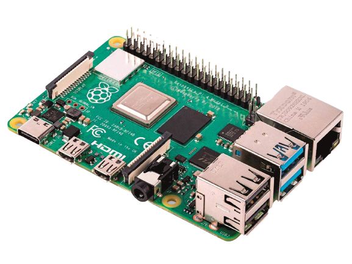

<h1 align="center">Embedded Linux Projects</h1>

  

  

---

In this repository, there are some simple projects done with the **Raspberry Pi 4 Model B 4GB**.

All of the projects are **open source** and you can use it for your own projects.

In **[projects](projects/)** directory, for every project there is:

* **xyz.py** file with the code of the project.
* **xyz.pdf** file with the description of the project.

Where **xyz** is the name of the project.

So, before using any of the projects, I recommend reading the **xyz.pdf** file.

---

## 🛠️ Development Tools Required

In order to use, and develop any of these projects, read this [guide](assets/tools.md) to know what tools are required before you start.

---

## 📞 Contact me

  

## 📖 References

* [راسبيري باي ببساطة](http://simplyarduino.com/%D9%83%D8%AA%D8%A7%D8%A8-%D8%B1%D8%A7%D8%B3%D8%A8%D9%8A%D8%B1%D9%8A-%D8%A8%D8%A7%D9%8A-%D8%A8%D8%A8%D8%B3%D8%A7%D8%B7%D8%A9/): Abdulla Ali Abdulla
* Sparkfun's [Raspberry gPIo](https://learn.sparkfun.com/tutorials/raspberry-gpio)

## 🔓 Licenses

 All DOCUMENTS inside this work is licensed under a <a rel="license" href="http://creativecommons.org/licenses/by-sa/4.0/">Creative Commons Attribution-ShareAlike 4.0 International License</a>.

All SOURCE codes & BINARIES are licensed under Mit License.

  

  

---

## 🔏 Credits

All credits and external sources are listed inside the page and inside this repo, references themselves.
