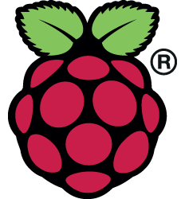

# 🛠️ Development Tools Required

Here, we are talking about development tools required to build and run the projects in this repository (8051 microcontroller projects).

**The tools are**:

* **OS**: <u>Raspberry OS</u> 
  
  Raspberry Pi needs an operating system to work. Raspberry Pi OS (previously called Raspbian) is the officially supported operating system for the Raspberry Pi.

  Download: [https://www.raspberrypi.com/software/](https://www.raspberrypi.com/software/)

* **Interpreter**: <u>Python 3</u> 
  
  Python is a programming language that is used to write programs for computers. It is a high-level, interpreted programming language.

  Download: [https://www.python.org/downloads/](https://www.python.org/downloads/)
* **Text Editor**: There are many options available inside Raspberry OS:
  * <u>Thonny</u> 
  
    Download: [https://thonny.org/](https://thonny.org/)
  * <u>Mu</u> 
  
    Download: [https://codewith.mu/](https://codewith.mu/)
  * <u>Visual Studio Code</u> 

    Download: [https://code.visualstudio.com/](https://code.visualstudio.com/)

  Thonny, Mu, and VS Code are free and open-source. they are cross-platform and run on Windows, Mac OS X, and Linux. Thonny and Mu are pre-installed on the Raspberry Pi OS. They provide in-app text editors, command line interface, and debugging tools.
  You can download the VS Code on the Raspberry Pi OS from Raspberry Pi OS start menu, or from the link above.

  There are also many other text editors available, such as Nano and Leafpad. But those do not provide a command line interface, only a text editor, with colorization and syntax highlighting.
* **RPi.GPIO**:
  
  RPi.GPIO is a Python library that allows you to control the GPIO pins on the Raspberry Pi.

  Download: [https://pypi.org/project/RPi.GPIO/](https://pypi.org/project/RPi.GPIO/)